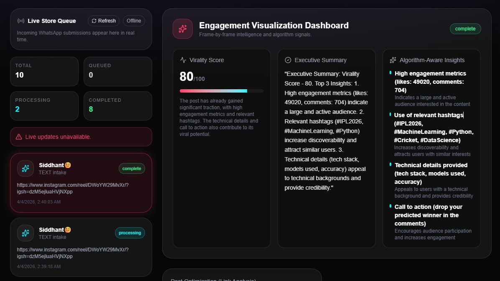
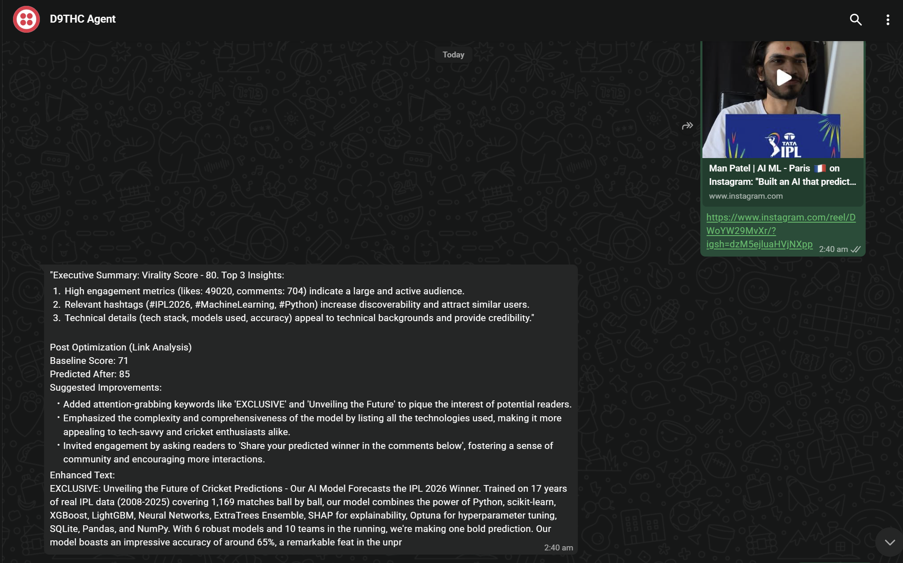
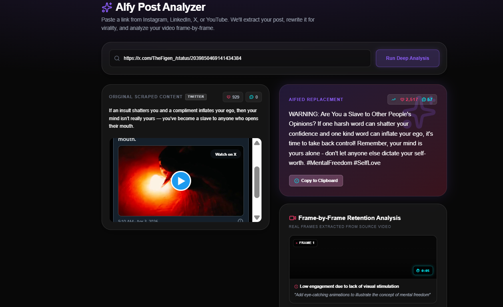
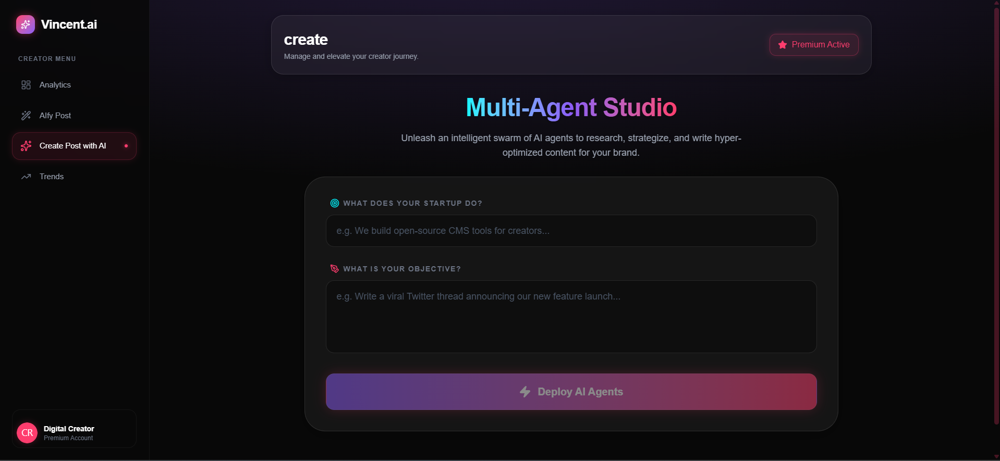

# 🚀 VincentAI – Autonomous Social Media & Analytics Platform
Automated Social Management, Real-Time Cross-Platform Analytics & AI Digital Producer

[](https://python.org/) [](https://reactjs.org/) [](https://fastapi.tiangolo.com/) [](https://groq.com)

**Features** • **Demo** • **Installation** • **Architecture** • **API**

## 🏗️ Architecture Diagram


## 🖼️ UI Screenshots & Features
### 1. Animated Client Dashboard & Landing Page
**Homepage**
A uniquely crafted landing experience featuring a high-tech aesthetic, dynamic neon animations, and smooth glassmorphism components to act as the gateway to the analytics hub.


### 2. D9THC WhatsApp Agent
**Mobile AI Assistant**
Interact directly with your analytics and Socials AI via WhatsApp. Powered by Twilio, the D9THC Agent allows you to request insights, generate post ideas, and execute publishing commands right from your phone.


**Live WhatsApp Chat with D9THC Agent**
A real conversation with the D9THC Agent over WhatsApp — asking for insights, getting AI-generated responses, and triggering social actions entirely through natural language messaging.


### 3. Socials Analytics Center
**User Dashboard**
Consolidated cross-platform data management. Track real-time engagement and audience metrics simultaneously across LinkedIn, Instagram, X (Twitter), and YouTube.

### 4. AiFy Post Generation
**Automated Content Creation**
Leverage the AI to automatically draft, format, and push highly engaging posts tailored seamlessly to the respective platform algorithms.


### 5. Multi-Agent Workflows
**LangGraph Orchestration**
Under the hood, powerful multi-agent routines coordinate task execution, cross-checking insights and formulating comprehensive strategies.


---

## 🎯 System Overview
This project is an advanced **AI-Powered Social Lifecycle Platform** designed to drastically streamline content scheduling, real-time analytics aggregation, and intelligent marketing automation. It bridges the gap between disparate social media apps using the power of autonomous AI tool execution and robust data integration.

## 🚀 What It Does
- **Native Social Integration:** Pulls direct analytics loops from official endpoints like the **LinkedIn Developer API** and **YouTube Data API**.
- **AI Digital Producer (Agent):** Uses state-of-the-art **LangGraph** workflows powered by **Groq APIs** to plan out strategic content rollouts and intelligently analyze social standing.
- **Composio Automation Bridge:** 
  - Dynamic frontend OAuth integrations meaning users can connect Instagram/X/FB safely without leaving the app.
  - Seamlessly turns autonomous AI reasoning into actual published posts and workflow commands via a dedicated Composio Bridge Executor.
- **Twilio WhatsApp Integration (D9THC Agent):** Connects the LangChain AI Digital Producer directly to your phone via WhatsApp, serving as an always-on mobile AI marketing assistant.
- **Live WebSocket Engine:** Ensures all analytical graphs and data metrics update dynamically as the backend pulls fresh data, avoiding stale pages or forced browser refreshes.

---

## 📊 Performance & Technologies

### Component Breakdown
```text
┌─────────────────────────────────────────────────────────────┐
│  USER DASHBOARD: "Analyze my LinkedIn & Draft a Post"       │
└─────────────────────────────────────────────────────────────┘
                         │
                         ▼
┌─────────────────────────────────────────────────────────────┐
│  FASTAPI SERVICES (Python)                                  │
│  - WebSocket Live Store Data Sync                           │
│  - Secure API Routing & Protocol Bridges                    │
└─────────────────────────────────────────────────────────────┘
                         │
                         ▼
┌─────────────────────────────────────────────────────────────┐
│  AI DIGITAL PRODUCER (LangChain / LangGraph)                │
│  - Groq LLM processing core (Llama 3 / Versatile 70B)       │
│  - Evaluates user intent & formulates execution plan        │
└─────────────────────────────────────────────────────────────┘
                         │
                         ▼
┌─────────────────────────────────────────────────────────────┐
│  EXTERNAL EXECUTION & INTEGRATION                           │
│  ┌──────────────────────────────────────────────────────┐  │
│  │  Native Services: YouTube Data, LinkedIn Dev API   │  │
│  │  Composio Integration: In-app OAuth & Execution    │  │
│  │  Twilio API: WhatsApp Messaging Gateway (D9THC)    │  │
│  │  Tavily Search: Live trending context retrieval    │  │
│  └──────────────────────────────────────────────────────┘  │
└─────────────────────────────────────────────────────────────┘
                         │
                         ▼
┌─────────────────────────────────────────────────────────────┐
│  RESULT ISSUED VIA WEBSOCKET                                │
│  ✅ Dashboard graphs update in real-time                    │
│  ✅ Action executed flawlessly via Composio webhooks        │
└─────────────────────────────────────────────────────────────┘
```

### Key Technologies
- **Frontend:** React (Vite environment), TailwindCSS 4, Framer Motion (Complex UI animations), Recharts
- **Backend:** FastAPI (Python), Uvicorn, WebSockets (SSE/Starlette)
- **AI Engine:** LangGraph & LangChain, utilizing Groq API for rapid LLM reasoning, Tavily for live search.
- **Integration Layer:** Composio (Agent tool workflows), Twilio (WhatsApp API), Native API (LinkedIn, YouTube)
- **Storage:** SQLite (`live_store.db`)

---

## ⚙️ Installation & Setup

### Prerequisites
- Python 3.10+
- Node.js 18+
- Groq API Key
- Supported Social Access Keys (LinkedIn, YT) / Composio Credentials

### Backend Setup
```bash
cd backend

# Create Virtual Environment & Install dependencies
python -m venv .venv
source .venv/bin/activate  # (or .venv\Scripts\Activate.ps1 on Windows)
pip install -r requirements.txt

# Configure Environment
# Rename .env.example to .env and input your specific credentials:
# GROQ_API_KEY=...
# YOUTUBE_API_KEY=...
# COMPOSIO_API_KEY=...

# Start the Server
uvicorn app.main:app --reload --host 0.0.0.0 --port 4000
```
*The API runs on http://localhost:4000*

### Frontend Setup
```bash
cd frontend

# Install dependencies
npm install

# Start Development Server
npm run dev
```
*The App runs on http://localhost:5173*

---

## 🔌 API Endpoints (Snapshot)
### Analytics & Discovery
| Method | Endpoint | Description |
|---|---|---|
| `GET` | `/api/analytics/instagram` | Aggregates user analytics & media from Instagram |
| `GET` | `/api/analytics/youtube` | Fetches core channel insights & view percentages |
| `GET` | `/api/analytics/linkedin` | Handles official LinkedIn dev API insights |

### Intelligent Publishing & Workflows
| Method | Endpoint | Description |
|---|---|---|
| `POST` | `/api/publish/social` | Push scheduled captions & media via available hubs |
| `GET` | `/api/publish/options` | Resolves which social platforms are authenticated |

### Composio Actions Bridge
| Method | Endpoint | Description |
|---|---|---|
| `POST` | `/api/composio/webhook` | Inbound webhook listening for Composio status updates |
| `POST` | `/api/composio/publish-exec` | Built-in outbound executor (App to Composio bridge) |
| `POST` | `/api/composio/connect-link` | Fetch UI auth modals for specific platforms |

---

## 📜 License
This project is licensed under the MIT License - see the LICENSE file for details.

## 🙏 Acknowledgments
- **Groq** for ultra-fast intelligence generation.
- **Composio** for the versatile AI agent action protocols.
- **Framer Motion** for building next-generation seamless animations.
